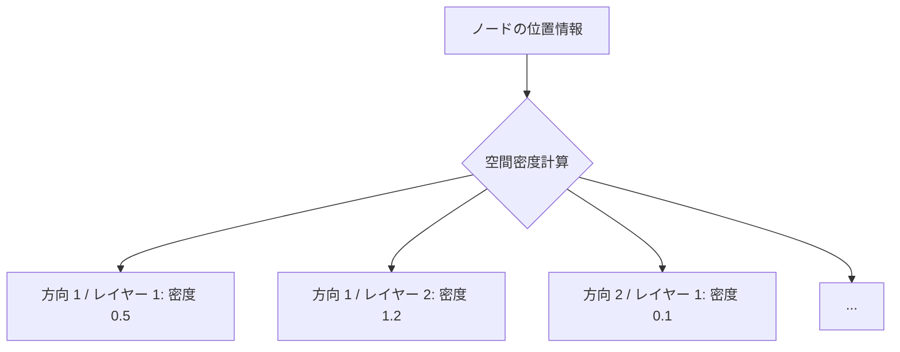

# 方向密度マップ (Spatial Density Map) 技術解説

- Status: 執筆中
- Author: fog
---

## 概要
**方向密度マップ (Spatial Density Map)** は、`mistlib` の P2P オーバーレイアルゴリズムにおいて、ネットワーク内のノードの空間的な分布状況を効率的に表現し、共有するためのデータ構造です。

大規模な P2P ネットワークにおいて、全ノードの位置情報を個別に管理することは通信コストの面で非効率です。方向密度マップは、周囲のノード分布を「方向」と「距離」に基づいて抽象化（ベクトル化）することで、少ないデータ容量でネットワークの混雑状況や疎密を把握することを可能にします。

## 内部構造

方向密度マップは、主に以下の3つの要素で構成されています。

### 方向の分割
3次元空間を複数の均等な方向に分割します。`mistlib` では、**フィボナッチ球 (Fibonacci Sphere)** アルゴリズムを用いて、球面上に均一に配置された $N$ 個の単位ベクトルを生成します。

### 距離の階層
各方向に対して、距離に応じた複数の階層（レイヤー）を設けます。例えば、中心から近い順に「近距離」「中距離」「遠距離」のように分割されます。

### 密度マップ
「特定の方向」の「特定の距離階層」にどれだけのノードが存在するかを示す数値（重み）を格納する配列です。



## アルゴリズム

### 生成
自身の周囲にいるノード群からマップを生成します。各ノードに対して、最も近い方向ベクトルとの内積を計算し、その値を該当するセルの密度に加算します。

### 射影 & 合成
他ノードから提供された密度マップを、自身の現在地から見た視点に変換し、自分を基準とした相対的な分布情報として自分のマップと統合します。これにより、直接接続していない遠くのノード分布も、抽象化された形で間接的に把握できます。

## ネットワークトポロジー制御

このマップは、主に **DNVE3ConnectionBalancer**（接続バランサー）によって利用されます。

1.  **接続先の最適化**: 
    - マップを参照し、ノードが少ない方向（疎な領域）にいるノードを優先的に接続対象として選びます。これにより、ネットワークが特定の場所に偏るのを防ぎ、全体的な疎通性を高めます。
2.  **重要なノードの特定**:
    - 自分が持っていない方向の密度情報を持っているノードを「重要」と判断し、優先的に接続を維持します。
3.  **負荷分散**:
    - 特定の方向にノードが密集しすぎている場合、その方向への新規接続を抑制し、通信負荷を分散させます。


## 実装の詳細 (Rust)


```rust
pub struct SpatialDensityData {
    pub density_map: Vec<f32>, // 密度データ（方向数 × レイヤー数）
    pub position: Vector3,     // マップの中心座標
    pub dir_count: usize,      // 方向の分割数
    pub layer_count: usize,    // 距離の階層数
}
```

また、通信量を削減するために `f32` 型を `u8` (byte) に変換してシリアライズしています。
